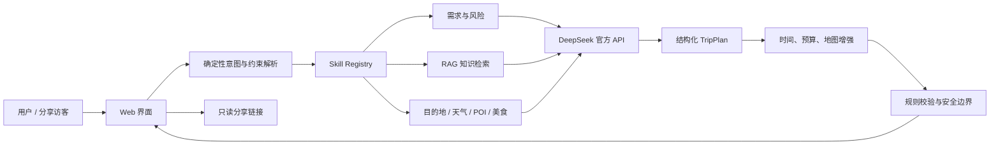

<div align="center">

# 漫游策 · WanderPlan

### 一个会查询、会规划、能持续修改，也能分享给朋友的旅行智能体

从一句自然语言需求出发，自动编排旅行 Skills、轻量 RAG 与实时数据源，生成结构化的逐日路线、美食建议、预算和地图入口。

[](https://nextjs.org/)
[](https://react.dev/)
[](https://www.typescriptlang.org/)
[](https://platform.deepseek.com/)
[](#测试与质量保障)

[在线体验](https://wanderplan-rag-agent.nicklaus-itaqueri.chatgpt.site) · [快速开始](#快速开始) · [Skill 编排](#skill-编排) · [完整项目报告](docs/PROJECT_REPORT.md)

</div>

> [!IMPORTANT]
> 漫游策只提供旅行信息查询与行程规划，不执行预订、下单、占座或支付。动态价格、营业时间和开放政策应在出发前通过官方渠道再次确认。

## 为什么做这个项目

普通旅行对话很容易给出一份“看起来合理”的答案，却难以保证天数、预算、路线、信息来源和后续修改始终一致。漫游策把旅行规划拆成一组职责清晰、可测试、可替换的 Skills，再由服务端根据用户意图动态编排，让模型专注于生成和推理，让程序负责约束、校验和降级。

你可以直接这样提问：

```text
9 月带 3 个朋友去贵州玩 3 天，预算 3000 元，喜欢美食，节奏不要太赶。
```

生成后还可以继续交流：

```text
第二天少安排一个景点，把晚餐换成当地特色菜，并保留核心景点。
```

## 核心能力

| 能力 | 实现方式 |
| --- | --- |
| 自然语言规划 | 解析目的地、日期、人数、预算、偏好和节奏，生成结构化逐日行程 |
| 多轮可修改 | 区分新建、修改、问答和分享意图，在原计划上做局部调整 |
| Skill 动态编排 | 运行时 Skill Registry 按意图选择需求、风险、检索、美食、路线与校验能力 |
| 轻量 RAG | 从版本化旅行知识库检索相关规则，作为可追踪上下文注入模型 |
| 实时信息增强 | 可选接入 Open-Meteo、FlyAI 和高德地图；不可用时自动降级 |
| 路线与美食规划 | 输出活动时间、停留时长、交通建议、餐饮方向和地图搜索入口 |
| 预算与风险校验 | 检查日程冲突、预算结构、来源、风险提示与“只查询不预订”边界 |
| 朋友分享 | 生成只读分享页，朋友使用浏览器即可查看，无需安装 Codex |

## 系统架构



一次完整请求的执行链路如下：

1. **解析输入**：先由确定性代码识别意图和硬约束，减少不必要的模型调用。
2. **选择 Skills**：Registry 根据“新建 / 修改 / 问答 / 分享”组装本轮能力链。
3. **准备上下文**：检索 RAG 知识，并按需查询天气、景点候选、美食和风险信息。
4. **生成计划**：调用 DeepSeek 官方 API，输出约定结构的 `TripPlan` JSON。
5. **归一化与增强**：服务端补齐 ID、时间、预算、餐饮与地图路线信息。
6. **校验与降级**：检查结构、日程、预算、来源和非预订边界，外部服务失败时保留可用结果。
7. **交互与分享**：网页展示计划，支持继续修改、撤销和生成只读分享链接。

## Skill 编排

项目中的 Skill 不是一段超长 Prompt，而是由说明、运行时逻辑、规则参考和模型配置组成的独立能力单元：

```text
skills/<skill-name>/
├── SKILL.md           # 能力边界、输入输出与使用规则
├── runtime.ts         # 可执行的 prepare / validate 逻辑
├── references/        # 领域规则或结构约束
└── agents/openai.yaml # 模型侧展示与调用配置
```

| 用户意图 | 执行链 |
| --- | --- |
| 新建行程 | `collect-trip-needs` → `assess-trip-risks` → `retrieve-travel-knowledge` → `research-destination` → `discover-flyai-pois` → `plan-local-food` → `compose-itinerary` → `optimize-map-route` → `validate-itinerary` |
| 修改行程 | `assess-trip-risks` → `retrieve-travel-knowledge` → `revise-itinerary` → `optimize-map-route` → `validate-itinerary` |
| 旅行问答 | `assess-trip-risks` → `retrieve-travel-knowledge` → `research-destination` → `discover-flyai-pois` → `plan-local-food` → `validate-itinerary` |
| 分享计划 | 服务端直接执行 `share-trip`，分享令牌不交给模型生成 |

这种设计带来三个直接收益：Skill 可以单独测试；外部数据源可以替换；模型更换时，业务规则和安全边界仍然保留。

## RAG 如何工作

轻量知识库位于 [`knowledge/travel-knowledge.ts`](knowledge/travel-knowledge.ts)，检索器位于 [`lib/rag.ts`](lib/rag.ts)。它使用确定性的加权词法和中文双字片段检索，不加载任何本地模型：

```text
用户问题 → 关键词与中文片段匹配 → 相关知识条目排序 →
retrieve-travel-knowledge Skill → 注入 DeepSeek 上下文
```

RAG 保存适合版本管理的稳定规划原则；天气、POI、开放政策等动态事实则优先来自实时服务或官方查询入口。两者分工明确，避免把容易过期的信息固化进知识库。

## 快速开始

### 1. 环境要求

- Node.js `>= 22.13.0`
- 一个可用的 DeepSeek API Key
- 可选：高德 Web 服务 Key、FlyAI API Key

### 2. 安装依赖

```bash
git clone https://github.com/ZQYYYY111/wanderplan-trip-agent.git
cd wanderplan-trip-agent
npm install
```

### 3. 配置环境变量

复制模板并填写自己的密钥：

```bash
cp .env.example .env.local
```

Windows PowerShell：

```powershell
Copy-Item .env.example .env.local
```

| 变量 | 必需 | 默认值 / 说明 |
| --- | :---: | --- |
| `DEEPSEEK_API_KEY` | 是 | DeepSeek 官方 API Key，仅保存在服务端 |
| `DEEPSEEK_BASE_URL` | 否 | `https://api.deepseek.com` |
| `DEEPSEEK_MODEL` | 否 | `deepseek-v4-flash` |
| `DEEPSEEK_ROUTER_MODEL` | 否 | 默认与主模型一致 |
| `AMAP_WEB_SERVICE_KEY` | 否 | 用于 POI 与路线增强 |
| `FLYAI_API_KEY` | 否 | 用于旅行候选信息增强 |
| `FLYAI_MCP_URL` | 否 | `https://flyai.open.fliggy.com/mcp` |

### 4. 启动开发服务器

```bash
npm run dev
```

打开终端显示的本地地址即可使用。模型调用全部发生在服务端，浏览器不会接触 API Key。

## 常用命令

| 命令 | 用途 |
| --- | --- |
| `npm run dev` | 启动本地开发环境 |
| `npm run build` | 构建生产版本 |
| `npm run start` | 启动生产服务 |
| `npm run lint` | 执行 ESLint 检查 |
| `npm test` | 构建并运行全部自动化测试 |
| `npm run test:model` | 使用 `.env.local` 对真实模型做连通性测试 |
| `npm run db:generate` | 生成 Drizzle 数据库迁移 |

## 项目结构

```text
wanderplan-trip-agent/
├── app/                 # Web 页面、对话工作台、API 与分享页
├── lib/                 # Agent、路由、Skill Registry、RAG 和服务适配器
├── skills/              # 旅行能力单元及其规则、运行时与配置
├── knowledge/           # 可版本化的旅行规划知识库
├── tests/               # 路由、RAG、Provider 和渲染测试
├── scripts/             # 真实模型连通性测试脚本
├── docs/                # 完整项目报告
├── drizzle/             # 数据库迁移
├── worker/              # 托管运行入口
└── .openai/             # Sites 项目绑定信息（不含 Secret）
```

## 测试与质量保障

当前测试覆盖：

- 意图路由和行程约束解析
- RAG 召回、排序和上下文组装
- DeepSeek、天气、FlyAI、高德等 Provider 的成功与降级路径
- 服务端渲染与关键页面内容
- 行程 JSON 结构、预算、时间和非预订边界

提交代码前建议运行：

```bash
npm run lint
npm test
```

## 部署与分享

当前演示版本部署在 [OpenAI Sites](https://wanderplan-rag-agent.nicklaus-itaqueri.chatgpt.site)。访问者只需要浏览器，不需要 Codex、ChatGPT 客户端或本地模型。

部署到任意支持 Node.js / Workers 的平台时，请在平台控制台把真实密钥配置为服务端 Secret。仓库中的 [`.env.example`](.env.example) 只保存变量名和示例值。

## 安全说明

- `.env*` 已加入 `.gitignore`，真实 API Key 不进入 Git 历史。
- API Key 仅在服务端读取，不下发到浏览器。
- 分享令牌由服务端生成，模型不参与创建。
- 外部数据源失败时返回降级结果，不会自动转入预订或支付流程。
- 公开仓库前仍建议使用 GitHub Secret Scanning 或其他工具进行二次检查。

## 延伸阅读

更完整的功能边界、模块说明、数据流、超时分析、Skill 设计来源和后续优化建议，请阅读：

- [《漫游策旅行智能体完整项目报告》](docs/PROJECT_REPORT.md)

---

<div align="center">

**把模糊的旅行想法，变成可查询、可修改、可分享的具体计划。**

</div>
